# 🧺 Laundry App – Flutter & Firebase

A **modern on-demand laundry mobile application** built with **Flutter & Firebase**, designed for the Saudi market.
Users can choose services, select nearby laundries, schedule pickup & delivery, apply discounts, and place orders seamlessly.

---

## 🔗 Related Application

### 📱 Laundry Admin App

👉 **GitHub Repository:**
[https://github.com/amiraslam327/laundry-app-admin]

---

## 🚀 Features

* 📍 Nearby laundries with discounts
* 🧼 Multiple services (Deep Wash, Dry Clean, Fold, Hand Wash)
* 🌸 Fragrance selection
* 🛒 Smart cart with live price & discount calculation
* 📅 Pickup & delivery scheduling
* 💳 Cash on Delivery & Online Payment (ready)
* 📦 Order tracking & order history
* 👤 User profile with address management
* 🌍 Multi-language ready (English / Arabic)
* 🔐 Firebase Authentication & Firestore

---

## 📱 App Screenshots

<p align="center">
  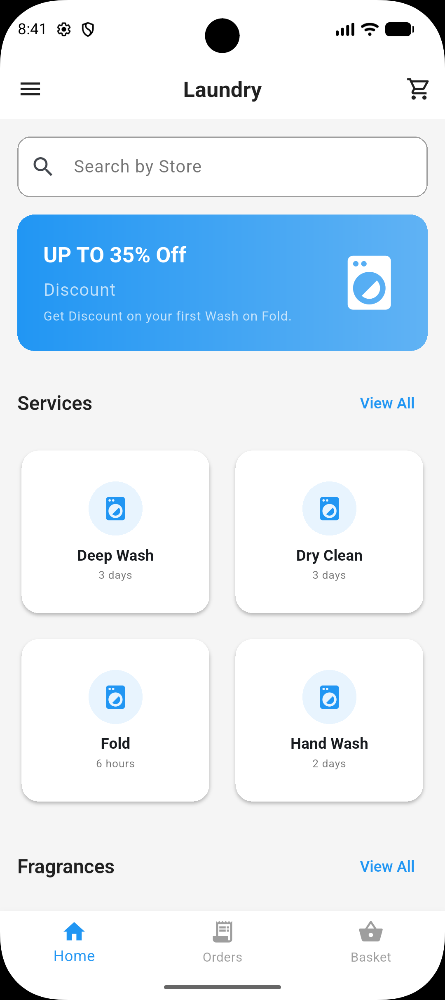
  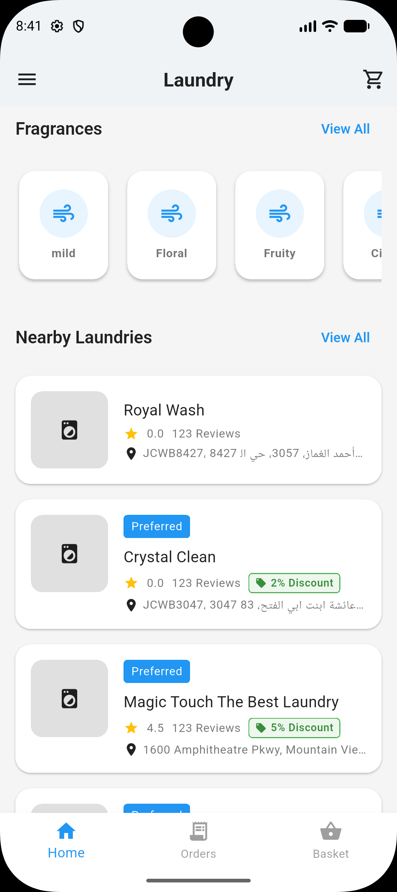
  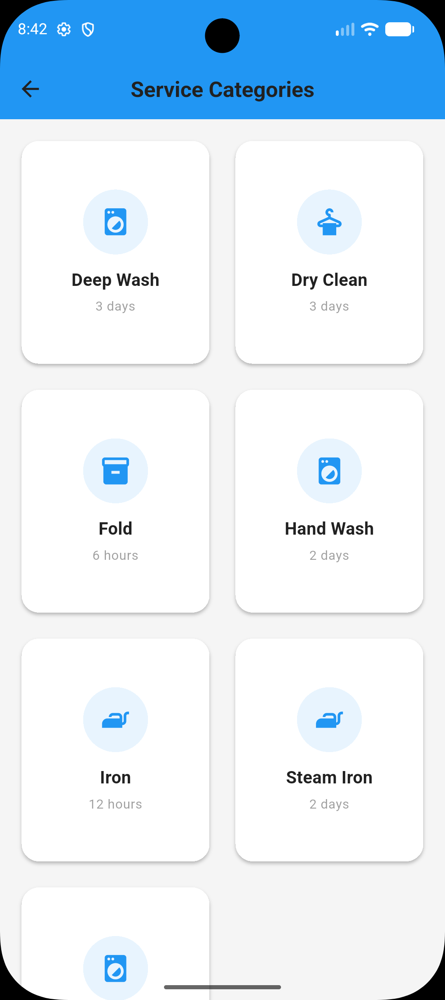
</p>

<p align="center">
  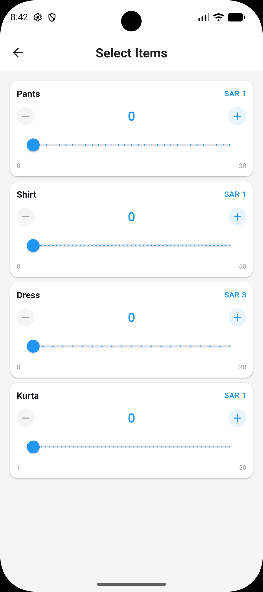
  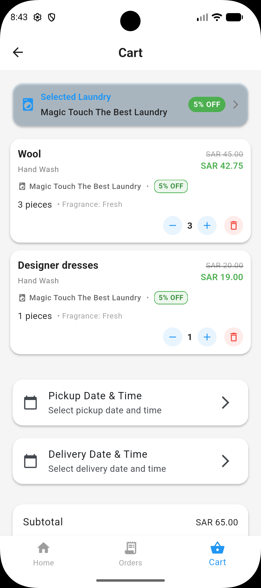
  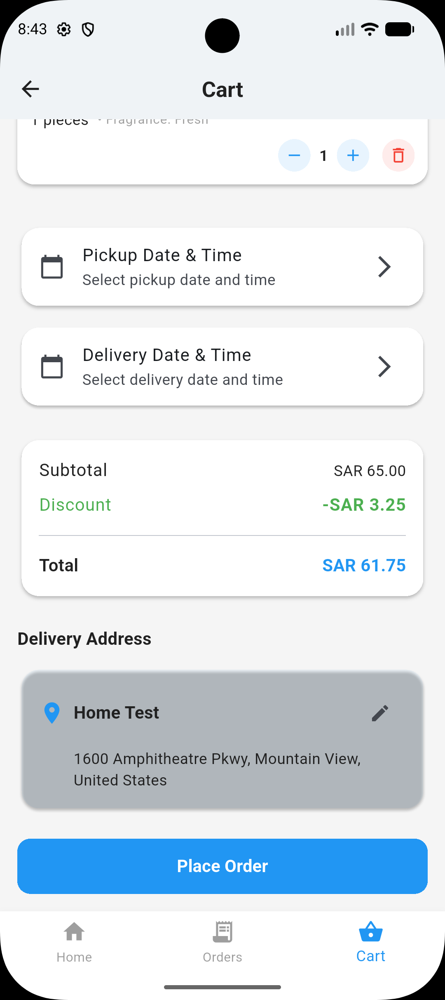
</p>

<p align="center">
  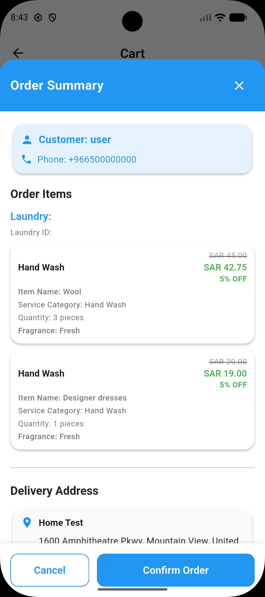
  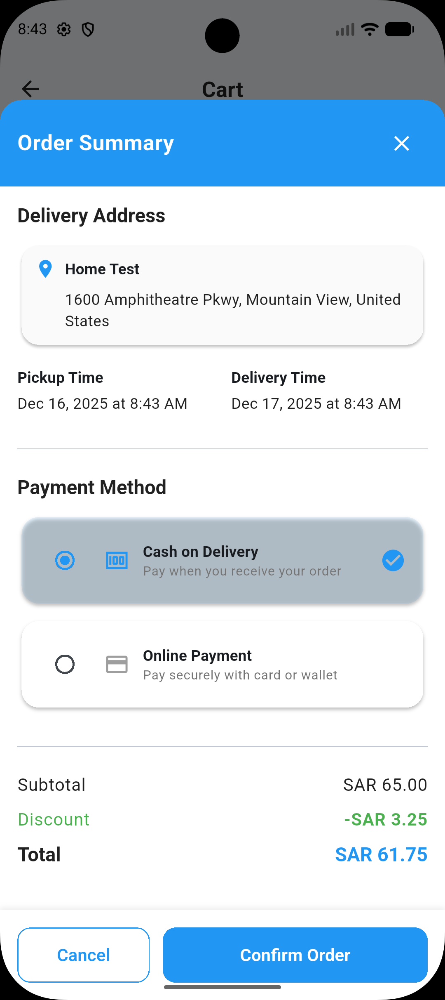
  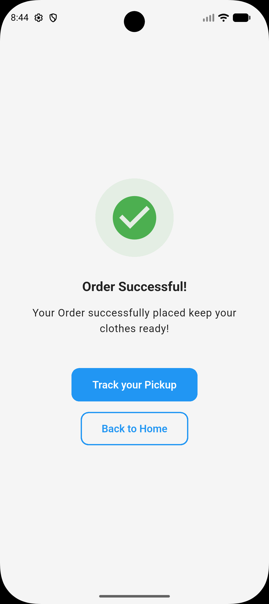
</p>

<p align="center">
  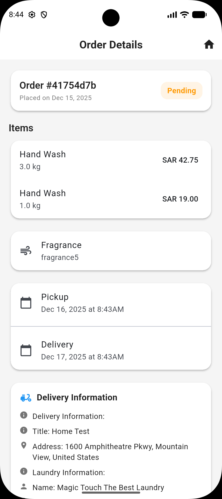
  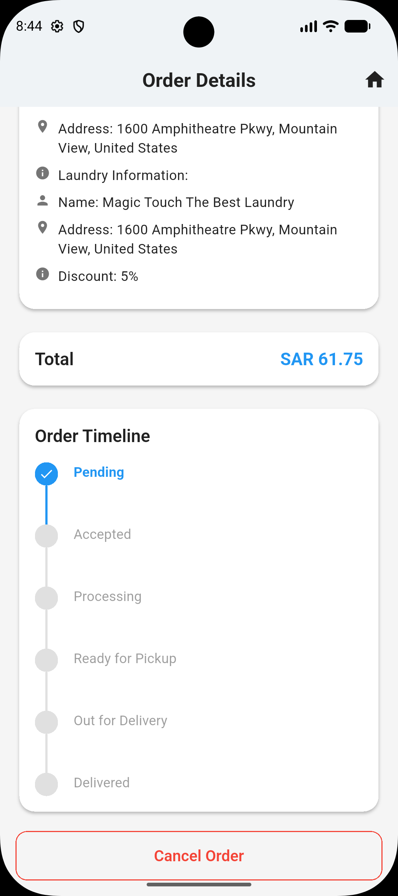
  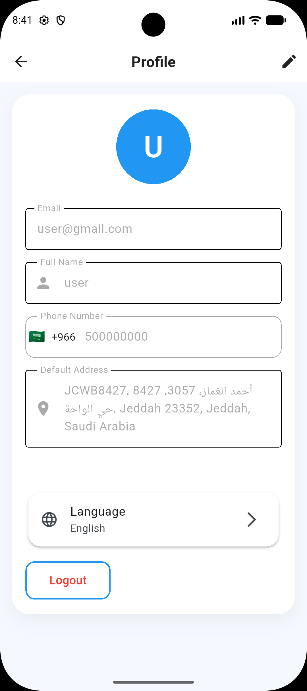
</p>

---

## 🛠 Tech Stack

* **Flutter** (Dart)
* **Firebase Authentication**
* **Cloud Firestore**
* **Firebase Storage**
* **Google Maps**
* **Provider / Riverpod (state management)**
* **REST-ready payment integration**

---

## 📂 Project Structure

```
lib/
├── app/
│   ├── localization/
│   ├── router/
│   └── theme/
├── features/
│   ├── admin/
│   ├── auth/
│   ├── basket/
│   ├── common/
│   ├── home/
│   ├── orders/
│   ├── payment/
│   └── profile/
├── utils/
└── main.dart
```

---

## ⚙️ Setup Instructions

### 1️⃣ Clone Repository

```bash
git clone https://github.com/your-username/laundry-app.git
cd laundry-app
```

### 2️⃣ Install Dependencies

```bash
flutter pub get
```

### 3️⃣ Firebase Setup

* Create Firebase project
* Enable **Authentication (Email / Phone)**
* Create **Firestore Database**
* Add `google-services.json` (Android)
* Add `GoogleService-Info.plist` (iOS)

### 4️⃣ Run App

```bash
flutter run
```

---

## 🗺 Google Maps Setup

Add API key in:

* **Android** → `AndroidManifest.xml`
* **iOS** → `AppDelegate.swift`

Enable:

* Maps SDK
* Places API

---

## 💼 Use Cases

✔ Laundry startups
✔ On-demand service apps
✔ Saudi market ready
✔ Admin panel & driver app extendable

---

## 📌 Future Enhancements

* 🧑‍💼 Admin Dashboard
* 🚚 Driver App
* 📲 Push Notifications
* 💳 Apple Pay / STC Pay
* ⭐ Ratings & Reviews

---

## 👨‍💻 Author

**Amir Aslam**
Flutter Developer | Mobile Apps
📍 Saudi Arabia

---

⭐ If you like this project, **give it a star** and feel free to fork!
